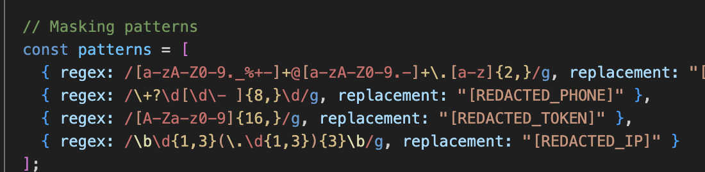
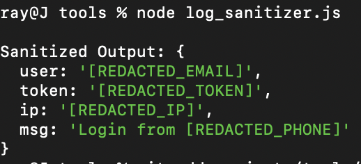
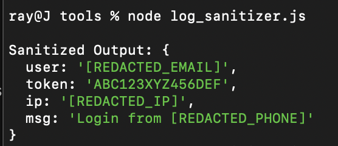

# Log Sanitizer

A small Node.js tool that removes sensitive info (emails, phone numbers, API tokens, IPs) from JSON logs.  
Built to keep logs clean and safe without breaking their structure.

---

### Features
- Masks emails, phone numbers, tokens, and IPs using regex  
- Keeps JSON structure valid  
- Easy to edit or add new patterns  
- Simple one-file setup – just run it with Node

---

### Example

**Input**
```json
{
  "user": "john@example.com",
  "token": "ABC123XYZ456DEF",
  "ip": "192.168.0.12",
  "msg": "Login from +64-21-456-789"
}
Output

json
Copy code
{
  "user": "[REDACTED_EMAIL]",
  "token": "[REDACTED_TOKEN]",
  "ip": "[REDACTED_IP]",
  "msg": "Login from [REDACTED_PHONE]"
}

### Screenshots

**Working Regex Patterns**  


**Sanitized Output (All Fields Redacted)**  


**Earlier Test (Token Not Redacted)**  


### Notes:
- The first test didn’t redact the token because it was only 14 characters long.
- After lowering the regex limit from {16,} to {10,}, it masked correctly.
- A quick reminder that regex tuning can make or break sanitization logic.

### Future ideas
- Load regex patterns from a config file
- Add CLI flags for input/output paths
- Try it as an AWS Lambda or a build step for log scrubbing